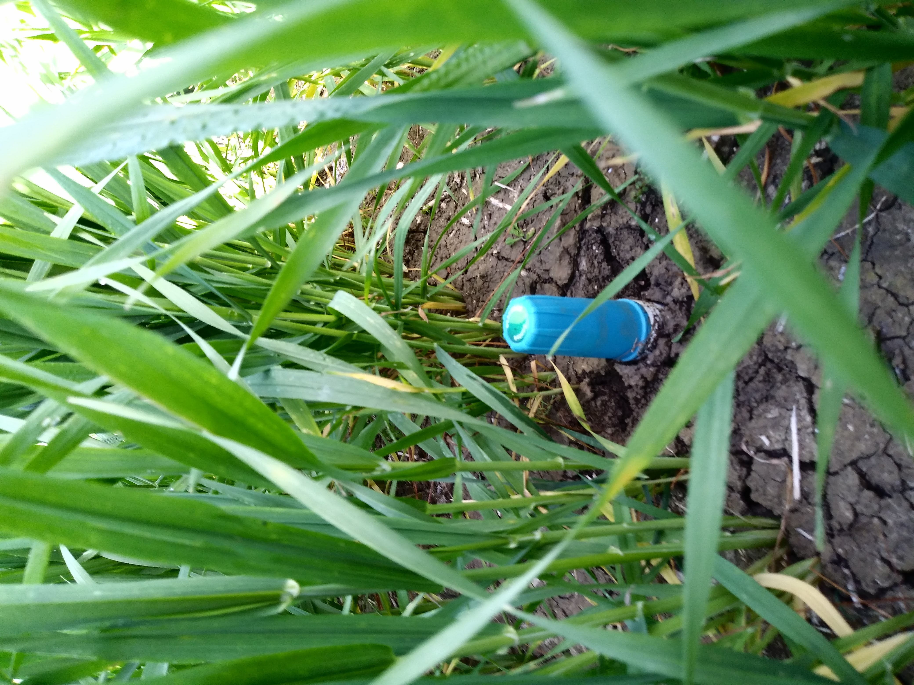

## EU-SHui WP2.1 
#  Field experiment 2020 - Finca Las Trescientas - Cordoba, Spain

> Author: Tomás Roquette Tenreiro

> Institute for Sustainable Agriculture (IAS-CSIC) - Córdoba, 2020

Data from 'Las Trescientas' winter wheat experiment 2020 (Guadalcazar, Cordoba, Spain). This repository includes all data to be shared within the context of work package 2.1 of the EU project SHui. 

1. Data from the field experiment conducted in 2019/20 by the agronomy department of the University of Cordoba and the Institute for Sustainable Agriculture (CSIC).
Shapefiles: 

 - Probes location and observation sites (SENTEK_probes.shp);
 - DEM (TopographicMap.shp);
 - Climate file (CLI.txt);
 - Water file: precipitation + probes data (SWC_daily_WP2.1.LasTrescientas_Experiment.2020.txt);

2. Please consider the attached PDF file for clarification regarding preliminary error assessment and data mining.

Please do not hesitate in contacting me in case you have any questions or would like to have further information: roquettetenreiro@gmail.com
